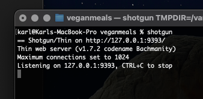
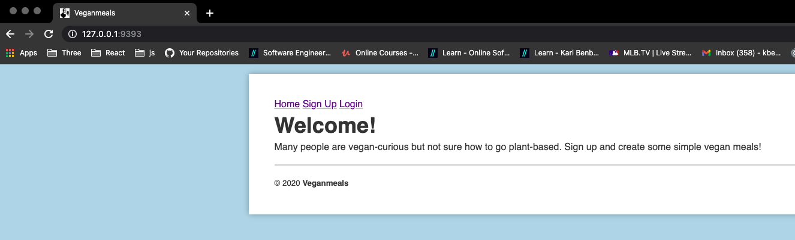
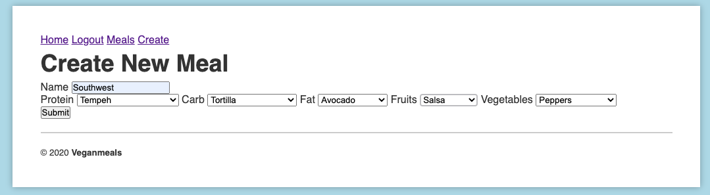

# Veganmeals
 A user creates simple meals from a list of plant based ingredients. 

# General Information
 This Sinatra web application utilizes the Model View Controller pattern while demonstrating an ActiveRecord relationship ('a user has many meals') with users having full CRUD (create, read, update, delete) capabilities of meal resources.

# Set Up
To use this app:
 Clone down the repository. 

 In terminal, cd into the project folder and run the following commands:
 `bundle install` 
 `rake db:migrate` 
 `shotgun` 

 

 In your browser, navigate to the http address listed after shotgun. ex. `http://127.0.0.1:9393/`

 After signing up and loging in, click the `Create` link to start building meals. 

 Once submitted, the newly created meal's show page will be displayed with links to edit and delete.

 In the top nav bar, click `Meals` to view a list, or index, of all created Meals. 
 
# Contributing Bugfixes or Features
For submitting something back, be it a patch, some documentation, or new feature requires some level of community interactions.

Committing code is easy:

Fork the this repository
Create a local development branch for the bugfix; I recommend naming the branch such that you'll recognize its purpose.
Commit a change, and push your local branch to your github fork
Send me pull request for your changes to be included
I apologize in advance for the slow action on pull requests and issues.

# License
Veganmeals is licensed under the MIT license. (http://opensource.org/licenses/MIT)